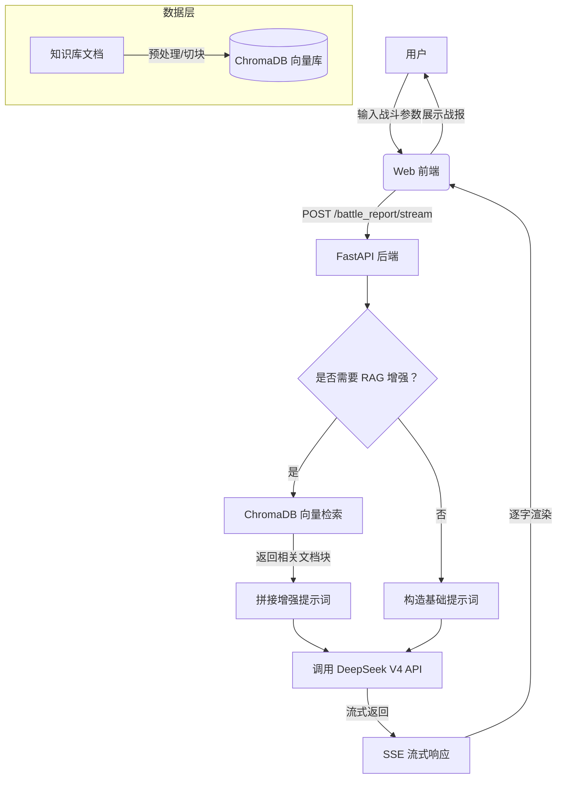

# AI 智能翻译与战报生成 API

基于 FastAPI + DeepSeek + Chroma_db 构建的多功能 AI 服务，提供通用翻译、文言文翻译、战报生成功能，并支持流式输出（SSE）。

## 🚀 公网访问地址

- **Swagger API 文档**: [http://39.106.78.243/docs](http://39.106.78.243/docs)
- **流式演示界面**: [http://39.106.78.243/static/index.html](http://39.106.78.243/static/index.html)

> 公网已部署，可直接体验流式输出效果。
> 服务部署于阿里云 ECS（2核 4GB），已稳定运行。

---

## ✨ 功能列表

| 功能 | 描述 | 端点 |
| :--- | :--- | :--- |
| 通用翻译 | 支持中英日法德等多语言互译 | `POST /translate`<br>`POST /translate/stream` (流式) |
| 文言文翻译 | 将文言文翻译为现代白话文 | `POST /translate/classical`<br>`POST /translate/classical/stream` (流式) |
| 战报生成（RAG 增强） | 基于 ChromaDB 检索知识库，更准确、有考据地生成三种风格战报（古典白话、北欧史诗、黑暗哥特） | `POST /battle_report`<br>`POST /battle_report/stream` (流式) |

所有流式接口均使用 `text/event-stream` 响应，可实时逐字输出。

---

## 🛠️ 技术栈

- **框架**: FastAPI 0.115+
- **服务器**: Uvicorn (ASGI)
- **AI 模型**: DeepSeek V4 Pro (OpenAI SDK)
- **数据校验**: Pydantic 2.10+
- **容器化**: Docker & Docker Compose
- **前端**: HTML + Tailwind CSS + 原生 JavaScript

---

## 🧠 系统架构


---

## 📦 本地开发环境搭建

### 1. 克隆项目
```bash
git clone https://github.com/forestMao340/Battle_Report.git
cd my_api_project

---

### 2. 创建并激活虚拟环境

```bash
python -m venv .venv
source .venv/bin/activate      # Linux/macOS
.venv\Scripts\activate         # Windows

---

### 3.安装依赖

```bash
pip install -r requirements.txt

---

### 4.配置环境变量

创建 .env 文件（参考 .env.example）：

```text
DEEPSEEK_API_KEY=sk-你的DeepSeek密钥

---

### 5.启动服务

```bash
uvicorn app.main:app --reload

访问 http://localhost:8000/docs 查看 API 文档，访问 http://localhost:8000/static/index.html 体验流式界面。

---

## 🧠 RAG（检索增强生成）架构

本项目在战报生成中集成了 RAG 技术：

1. **知识库构建**：将《西游记》原著、北欧神话、战锤40K背景等文本切块，使用 `sentence-transformers` 生成向量，存入 ChromaDB。
2. **检索增强**：用户请求战报时，系统先根据输入（进攻方、防守方、地点、风格）检索最相关的 3 个知识块。
3. **生成增强**：将检索到的知识块作为上下文，连同提示词一起发送给 DeepSeek，生成更准确、有考据的战报。

**技术组件**：
- **向量数据库**：ChromaDB（持久化存储）
- **Embedding 模型**：`paraphrase-multilingual-MiniLM-L12-v2`（支持中文）
- **生成模型**：DeepSeek V4（通过 OpenAI SDK 调用）

### 初始化知识库索引（RAG）

项目使用 ChromaDB 作为向量数据库，首次启动前需要运行索引脚本：

```bash
确保 data/ 文件夹中有知识文档（.txt 文件）
python -m app.services.rag_indexer

## 🐳 Docker 部署

### 构建镜像

```bash
docker build -t my-fastapi-api .

---

### 运行容器

```bash
docker run -d -p 80:8000 --restart always --name fastapi-app \
  -e DEEPSEEK_API_KEY="你的密钥" \
  -e PYTHONUTF8=1 \
  my-fastapi-api

---

### 使用 Docker Compose（推荐）

```bash
docker-compose up -d

---

## ☁️ 公网部署说明

项目已部署至公网服务器，通过 Docker 容器运行。

### ☁️ 部署要求

- **最低配置**：2核 4GB 内存（推荐，用于支持 ChromaDB + PyTorch）
- **操作系统**：Alibaba Cloud Linux 3 / Ubuntu 20.04+
- **依赖**：Docker 20.10+、Python 3.10+

### 本地构建与推送
```bash
docker build -t my-fastapi-api .
docker tag my-fastapi-api <your-registry>/<your-repo>:latest
docker push <your-registry>/<your-repo>:latest

### 服务器拉取与重启
ssh root@<your-server-ip>
docker pull <your-registry>/<your-repo>:latest
docker stop fastapi-app && docker rm fastapi-app
docker run -d -p 80:8000 --restart always --name fastapi-app \
  -e DEEPSEEK_API_KEY="你的密钥" \
  -e PYTHONUTF8=1 \
  <your-registry>/<your-repo>:latest

---

## 🚧 部署踩坑记录

在将项目部署到生产环境的过程中，我遇到了以下几个典型问题，并逐一解决，积累了宝贵的实操经验。

### 坑点 1：服务器内存溢出导致 SSH 连接中断
- **现象**：部署到 1核1GB 的阿里云轻量服务器后，服务运行一段时间便无响应，SSH 和 VNC 均无法连接。
- **排查**：通过阿里云控制台监控发现，在加载 ChromaDB 和 Sentence-Transformers 模型时，内存占用飙升至 100%，触发系统 OOM Killer。
- **解决**：
    1.  **临时方案**：在服务器上创建 2GB 的 Swap 交换分区，缓解物理内存压力。
    2.  **根本方案**：将服务器升级至 **2核4GB** 配置，确保内存充足，服务稳定运行。

### 坑点 2：Docker 镜像体积过大且构建缓慢
- **现象**：本地构建镜像耗时很长，且最终镜像体积达数 GB。
- **原因**：`requirements.txt` 中的依赖默认安装了 CUDA 版的 PyTorch，但服务器无 GPU，这些库完全多余。
- **解决**：在 `Dockerfile` 中**先安装 CPU 版 PyTorch**，再安装其余依赖。
    ```dockerfile
    RUN pip install torch --index-url https://download.pytorch.org/whl/cpu
    RUN pip install -r requirements.txt
优化后，镜像体积降至约 800MB，构建速度大幅提升。

### 坑点 3：容器启动失败，报错 Collection does not exist
现象：部署新版本时，容器启动后立即退出，日志显示 chromadb.errors.NotFoundError: Collection [battle_knowledge] does not exist。

原因：代码中直接使用 client.get_collection() 获取集合，但首次部署时该集合尚未创建。

解决：将代码改为 client.get_or_create_collection()，当集合不存在时自动创建，解决了启动依赖问题，并保留了回退机制。

---

## 📁 项目结构

```text

my_api_project/
├── app/
│   ├── __init__.py
│   ├── main.py                 # FastAPI 入口
│   ├── config.py               # 配置类
│   ├── models.py               # Pydantic 模型
│   ├── routers/                # 路由层
│   │   ├── translate.py
│   │   └── battle.py
│   ├── services/               # 业务逻辑层
│   │   ├── ai_client.py        # DeepSeek 调用（含流式）
│   │   ├── translate.py
│   │   └── battle.py
|   |   └── rag_indexer.py 
│   ├── static/                 # 前端静态文件
│   │   └── index.html          # 流式演示界面
│   └── utils/
│       └── helpers.py
└── Data/
│   └── Knowledge Base.txt
├── .env.example
├── .gitignore
├── requirements.txt
├── Dockerfile
├── docker-compose.yml
└── README.md

---

## 🧪 API 使用示例

### 通用翻译（非流式）

```bash 
curl -X POST http://39.106.78.243/translate \
  -H "Content-Type: application/json" \
  -d '{"text":"Hello","target_lang":"zh"}'

---

### 流式战报生成

```bash
curl -X POST http://39.106.78.243/battle_report/stream \
  -H "Content-Type: application/json" \
  -d '{"attacker":"孙悟空","defender":"二郎神","location":"花果山","plot":"大战三百回合","style":"classical"}' \
  --no-buffer

---

## 📌 环境变量说明

变量名	            必填	      描述
DEEPSEEK_API_KEY	✅	 DeepSeek API 密钥
PYTHONUTF8	        ❌	 设为 1 避免中文乱码

---

## 🧹 代码注释规范

---

所有函数、类、接口均包含清晰的 docstring，关键逻辑有行内注释，便于维护。

---

## 🤝 贡献指南

欢迎提交 issue 或 PR，请确保代码符合 PEP 8，并更新相应文档

---

## 📄 许可证

MIT License

---

## 🔗 相关链接

DeepSeek 官网 https://www.deepseek.com/
FastAPI  文档 https://fastapi.tiangolo.com/
项目仓库  https://github.com/forestMao340/Battle_Report